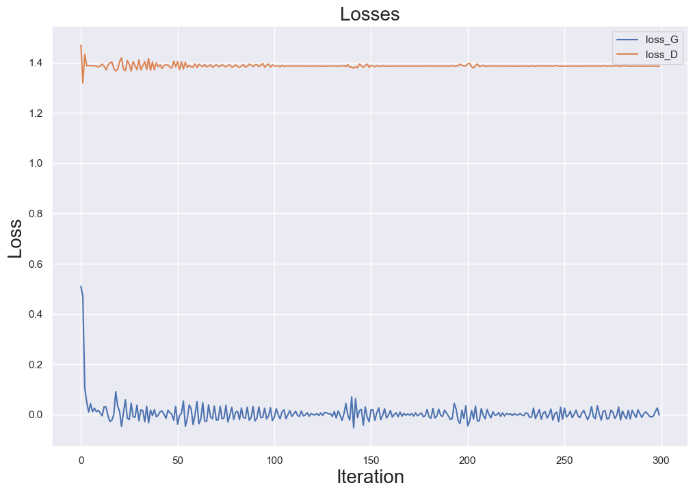
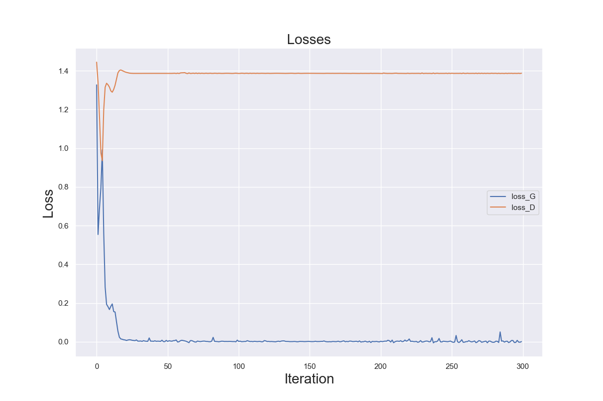
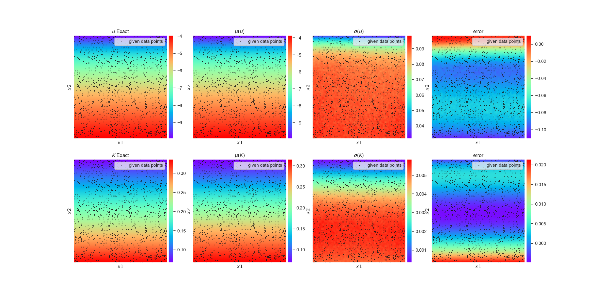
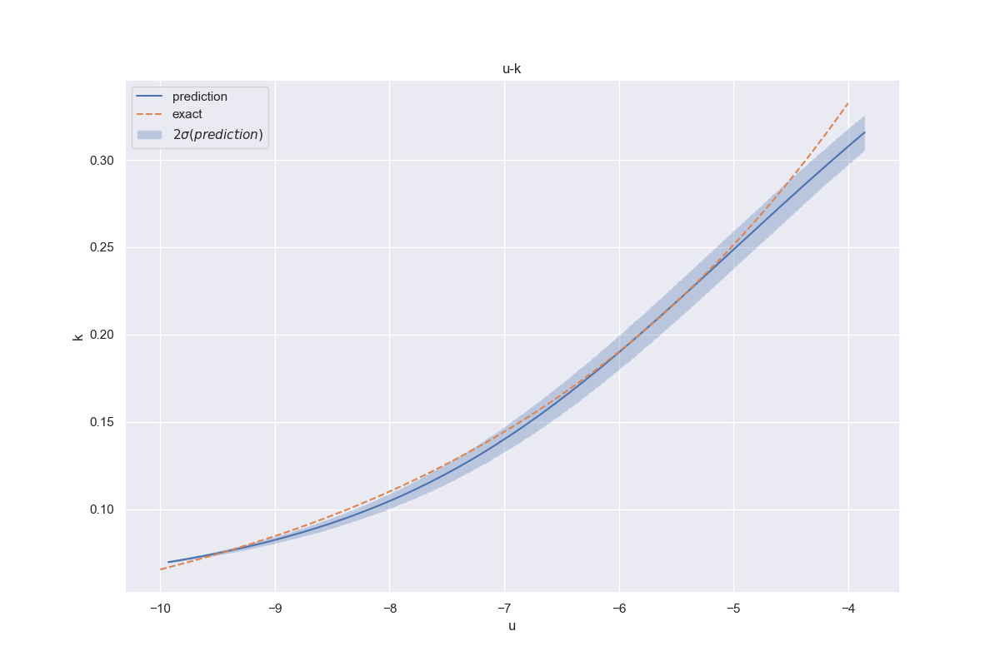

## Introduction

UQPINN = GAN + PINN

- **UQPINN** : Uncertainty Quantification Physics-Informed Neural Network
- **GAN** : Generative Adversarial Network
- **PINN** : Physics-Informed Neural Network

**Novalty** : "we will develop a flexible variational inference framework that will allow us to train such models directly from noisy input/output data, and predict outcomes of non-linear dynamical systems that are partially observed with quantified uncertainty"

## Reproduce

### ODE 

$$
\begin{aligned}
\frac{\partial^2 u}{\partial x^2} &- u^2 \frac{\partial u}{\partial x}  f(x) & x&\in[-1,1]
\\
f(x) &= -\pi^2 sin(\pi x) - \pi cos(\pi x)sin(\pi x)^2
\\
u(x) & \sim \mathcal N(sin(\pi), noise)& x&=\{-1,1\}
\end{aligned}
$$

### Burgers

$$
\begin{aligned}
\frac{\partial u}{\partial t} &+ u\frac{\partial u}{\partial x} - \nu \frac{\partial^2 u}{\partial x^2} = 0
 \quad &x&\in[-1,1], t\in[0,1]
\\
u(0,x) &= -sin(\pi x)
\\
u(t, x) &= 0 \quad & x&=\{-1, 1\}
\\
\nu &= \frac{0.01}{\pi}
\end{aligned}
$$

### Darcy

$$
\begin{aligned}
\nabla_\vec x &(K(u)\nabla_\vec x u(\vec x)) = 0  & \vec x&\in [0,L_1]\times [0,L_2]
\\
u(\vec x) &= 0 & x_1 &= L_1
\\
-K(u) &\frac{\partial u(\vec x)}{\partial x_1} = q & x_1 &= 0
\\
K(u) & = K_s \sqrt{s(u)} \left(1-(1-s(u)^{\frac{1}{m}})^m\right)^2 & x_2 &= \{0, L_2\}
\\
s(u) &= \left(1 + \left(\alpha (u_g - u)\right)^{\frac{1}{1-m}}\right)^{-m}
\end{aligned}
$$

## Comparison

### ODE

### Darcy

![img]